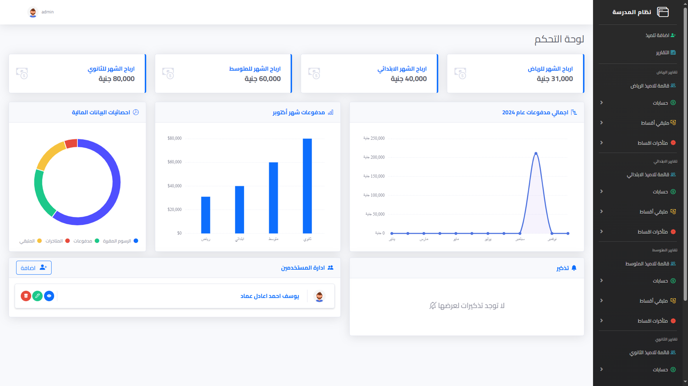
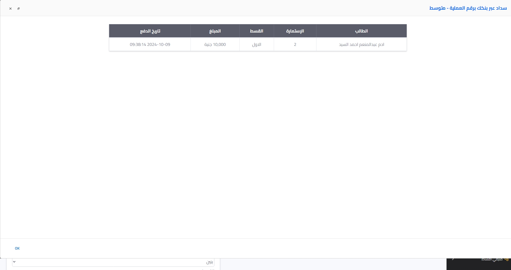
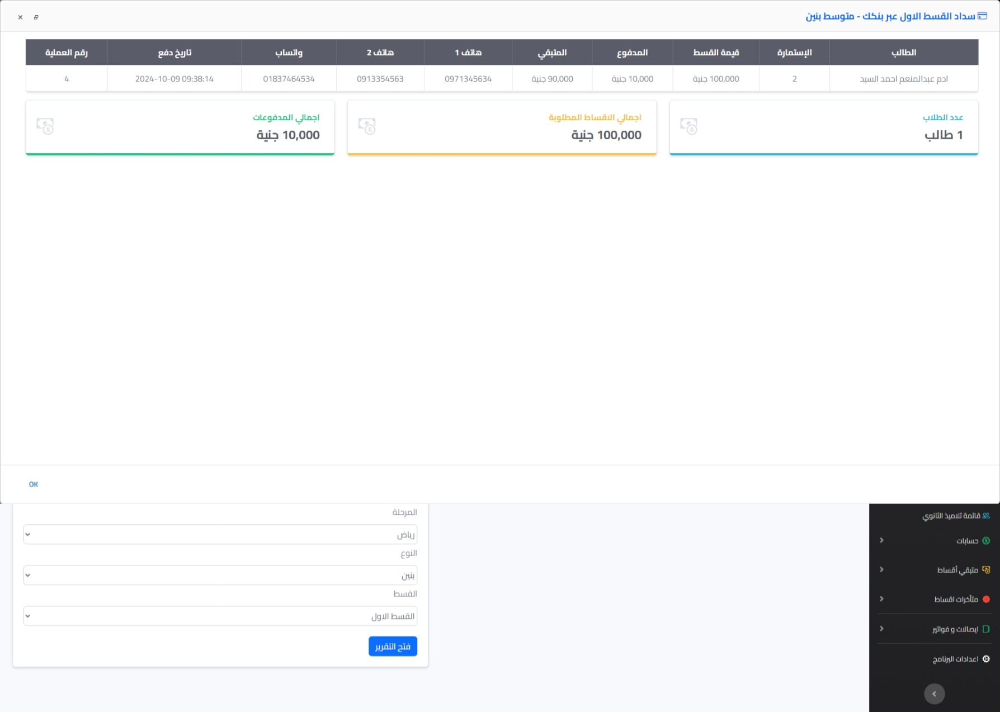
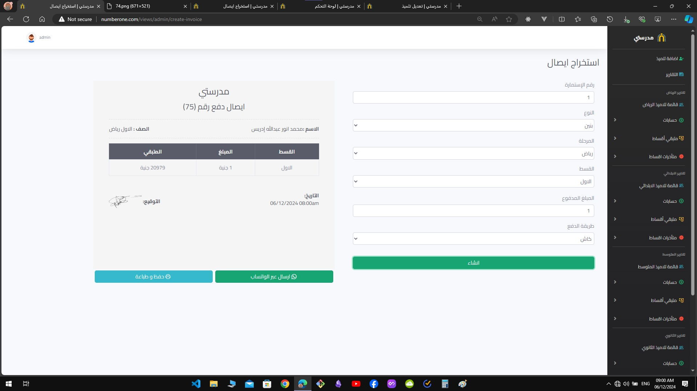
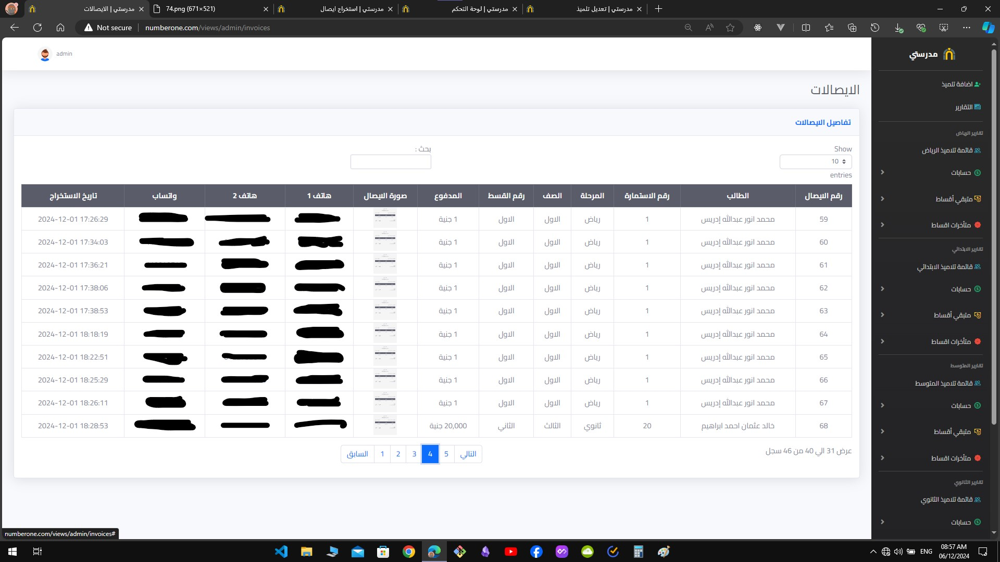
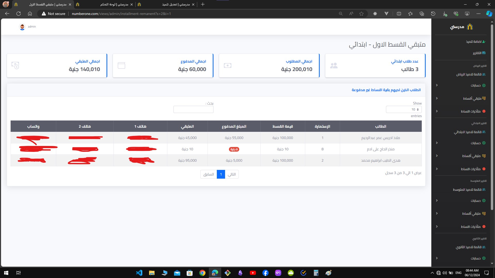
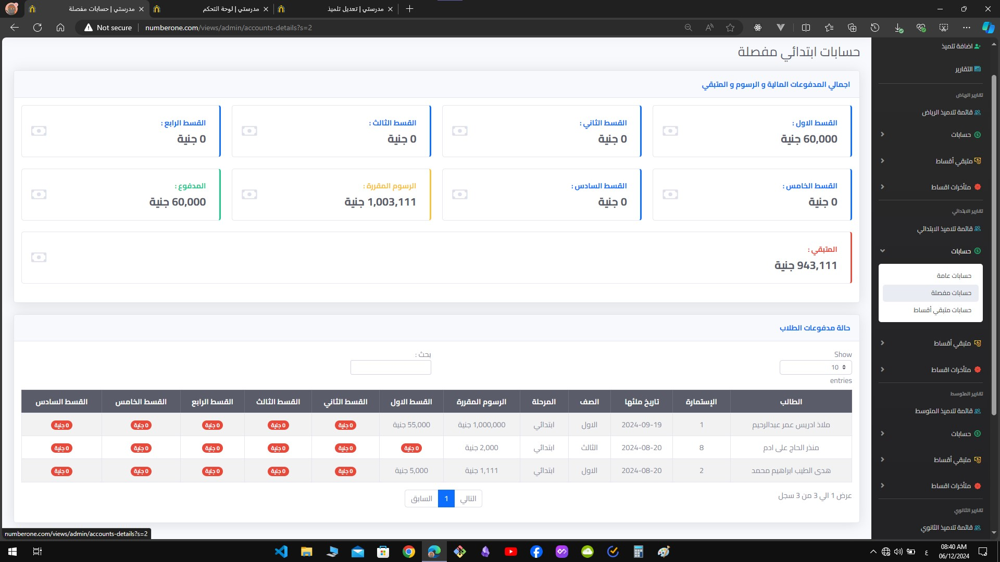
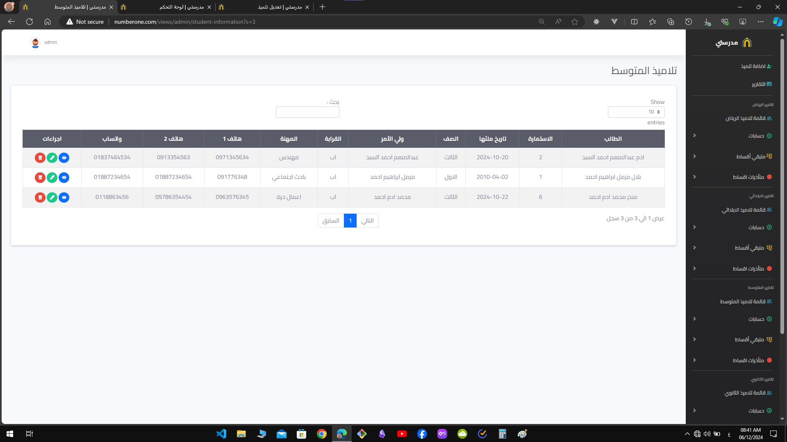
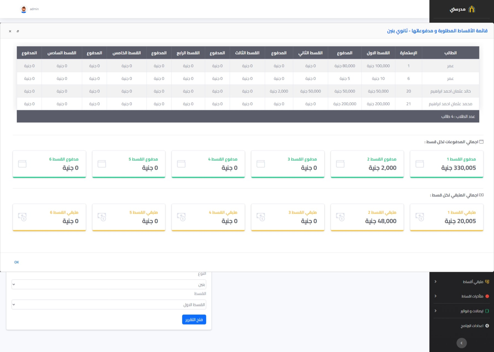
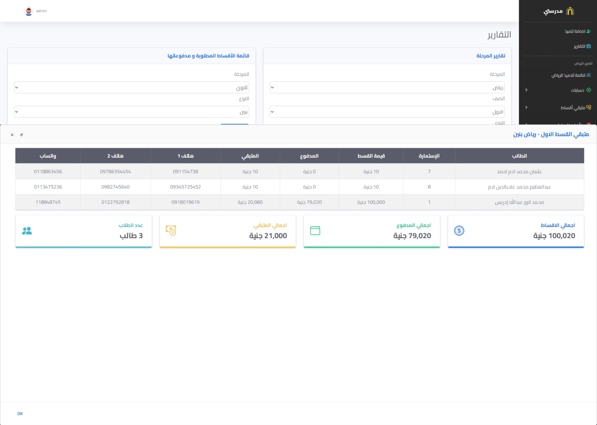

# School System

Praise be to Allah, by whose grace good deeds are completed. 💙

It seems I’ve conquered the September challenge. 👀💙

After more than 3 weeks of relentless hard work, I’m thrilled to announce that the coolest project of 2024 is finally complete! 💙

School Accounts Management System—an advanced solution that simplifies school account management and provides detailed, customizable reports.

Without further ado, here are the features:

✓ 4-in-1 System: Manage all educational stages from kindergarten to high school in one platform.

✓ Automated Student Accounts: Once a student is added, the system automatically creates an account with a username and password. The account includes details like the student’s name, class, tuition data (fees, payments, balances, and dues), and can be accessed via a dedicated login link.

✓ User Management: Comprehensive management of all system users.

✓ Payment Insights: Visualize payment data using charts that display monthly payment ratios and annual statistics.

✓ Backup Feature: Backup the database, download backup files, and restore data from external files.

✓ Data Export: Export data to Microsoft Excel files with download capabilities.

✓ Receipt Management: Generate tuition payment receipts directly from the system and send receipt images via WhatsApp using the student’s registered WhatsApp number.

✓ Print Receipts: Print receipts effortlessly through the program.

✓ Admin Alerts: Reminders for admins to perform backups and export Excel files every 5 days.

✓ Settings Page: The admin can customize:

Program name.

WhatsApp payment message content.

Add a signature image for inclusion in receipts.

Backup preferences.

Excel data export options.

End-of-Year Cleanup:

To prepare for the new academic year, the system includes a secure “Delete All Data” feature. Data deletion requires password confirmation, ensuring safety.

Old data will remain stored in Excel files for reference whenever needed.

---

Currently finalizing the hosting setup, so the system will soon be accessible via this link 👇
http://myschool.great-site.net/

This project has been a massive challenge over the past few weeks, but the satisfaction of completion makes the journey worthwhile. 💙

Don’t forget to share your feedback! 💙

#ChallengeConquered 🤷💙

<!--  -->
